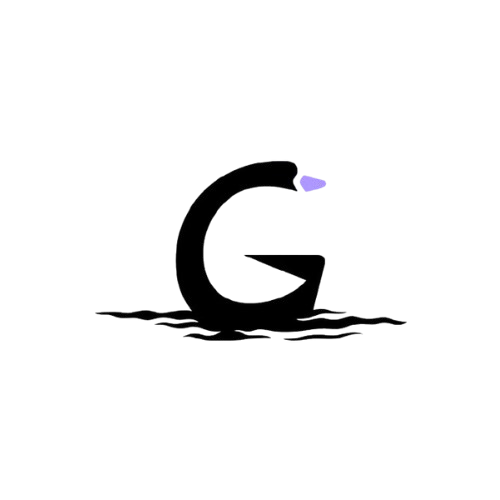

<div align="center">
  

  # Goose In A Pond

  **Privacy-first, fully local AI smart home assistant**

  Built on [Goose](https://github.com/aaif-goose/goose) · Runs on your hardware · No cloud required

  [](https://www.apache.org/licenses/LICENSE-2.0)
  [](http://creativecommons.org/licenses/by/4.0/)
  [](https://www.rust-lang.org)
  [](https://github.com/jarida-io/goose-in-a-pond)

</div>

---

## What is Goose In A Pond?

**Goose In A Pond (GIAP)** is a fully offline, privacy-first AI assistant for your smart home. It runs entirely on edge hardware — primarily targeting the **NVIDIA Jetson Orin Nano** — with no mandatory cloud dependency. Your data, devices, and conversations never leave your local network.

GIAP is built on [Block's Goose](https://github.com/aaif-goose/goose) open-source agent framework and extends it with a complete smart home layer: device registry, voice I/O, cron scheduling, memory, and a companion mobile app called **Goose On The Go (GOTG)**.

### Key capabilities

| Capability | Description |
|---|---|
| **Local LLM** | Ollama, llamafile, or in-process GGUF — no API keys |
| **Voice I/O** | Whisper ASR (whisper.cpp) + Piper TTS, fully on-device |
| **Smart devices** | Register, query, and control devices via MCP tools |
| **Persistent memory** | SQLite-backed memory fragments injected into every prompt |
| **Schedules** | Cron-style task automation with webhook dispatch |
| **Desktop app** | Native Tauri 2 app (macOS + Linux) with GUI, Voice, and Canvas modes |
| **Mobile companion** | Goose On The Go — remote control via authenticated REST API |
| **Privacy** | All inference, voice, and memory runs 100% on-device |

---

## Architecture

GIAP uses a **Hexagonal (Ports & Adapters)** architecture. The core domain never imports from Goose or any framework — it only talks through trait interfaces.

```
pond-server  (binary — wires everything together)
    │
pond-api     (Axum HTTP router + REST DTOs)
    │
pond-core    (domain logic — pure Rust, no external deps)
  ├── domain/    pure types: ChatMessage, Device, Schedule, Memory …
  ├── ports/     async_trait interfaces: Agent, LlmProvider, VoiceInput …
  └── services/  ChatService, context compaction, mock implementations
    │
pond-infra                  (SQLite via SQLx — two databases)
pond-infra-scheduler        (tokio-cron-scheduler adapter)
pond-adapters-goose         (wraps Block's Goose agent)
pond-adapters-weather       (Open-Meteo HTTP client)
pond-adapters-whisper       (Whisper ASR + wake word detection)
pond-adapters-piper         (Piper TTS subprocess adapter)
pond-adapters-ollama        (Ollama HTTP provider)
pond-adapters-llamafile     (llamafile / OpenAI-compat provider)
pond-adapters-local-inference (in-process GGUF via llama-cpp-2)
pond-adapters-mcp-memory    (flat-file MCP memory)
pond-mcp-server             (GIAP as a Goose builtin MCP extension)
pond-desktop                (Tauri 2 desktop app — React + Rust)
```

**Detailed docs:**
- [Architecture Overview](./docs/architecture/components.md)
- [Data Flow & Lifecycle](./docs/architecture/data_flow.md)
- [Visual Workflow (Weather example)](./docs/architecture/visual_workflow.md)
- [Creating Ports & Adapters](./docs/creating-ports-and-adapters.md)

---

## Getting Started

### Prerequisites

- **Rust** stable (install via [rustup](https://rustup.rs))
- **Git** with submodule support
- For voice: [whisper.cpp](https://github.com/ggerganov/whisper.cpp) server + [Piper](https://github.com/rhasspy/piper) binary

## Fork the repository.  

### 1. Clone

```bash
git clone --recursive https://github.com/your-username/goose-in-a-pond.git
cd goose-in-a-pond
```
[Click here](https://github.com/settings/tokens/new) to generate a new access token when asked for password, copy token generated and paste it in the password field.

### 2. Build

```bash
# Fast build — skips Goose compilation (~2s)
cargo build -p pond-core -p pond-infra -p pond-api -p pond-server

# Full workspace — compiles Goose from the submodule (~10 min first time)
cargo build --workspace
```

### 3. First-time setup

Downloads the Whisper ASR model and initializes the database:

```bash
cargo run -p pond-server -- setup
# Choose model size (default: base.en, ~141 MB)
cargo run -p pond-server -- setup --model tiny    # 39 MB  — fastest
cargo run -p pond-server -- setup --model small   # 244 MB — better accuracy
```

### 4. Run the server

```bash
# HTTP server + REST API + web dashboard
cargo run -p pond-server -- serve

# With options
cargo run -p pond-server -- serve --port 4000 --open --debug
```

### 5. Chat

```bash
# Text mode (keyboard input, default)
cargo run -p pond-server -- chat

# With a local Ollama model
cargo run -p pond-server -- chat --provider ollama

# With llamafile running on port 8080
cargo run -p pond-server -- chat --provider llamafile

# Voice mode (requires whisper.cpp server on port 9000)
cargo run -p pond-server -- chat --input whisper

# Voice + TTS (requires Piper binary and model)
cargo run -p pond-server -- chat --input whisper --tts piper \
  --tts-model /path/to/en_US-lessac-medium.onnx
```

### 6. Desktop app

```bash
cd pond-desktop
npm install
npm run tauri dev
```

The Tauri app starts `pond-server` automatically and provides three modes: GUI sidebar, Voice orb, and Canvas floating overlay.

---

## Voice Input (Whisper ASR)

GIAP uses [whisper.cpp](https://github.com/ggerganov/whisper.cpp) for speech recognition via its HTTP server — no C++ bindings or long compile times.

**Linux / macOS:**
```bash
git clone https://github.com/ggerganov/whisper.cpp
cd whisper.cpp && make server
./server -m ~/.local/share/goose-in-a-pond/models/ggml-base.en.bin --port 9000
```

**Windows:**
```powershell
git clone https://github.com/ggerganov/whisper.cpp
cd whisper.cpp
cmake -B build && cmake --build build --config Release --target server
.\build\bin\Release\server.exe -m %APPDATA%\goose-in-a-pond\models\ggml-base.en.bin --port 9000
```

Then start GIAP in voice mode:
```bash
cargo run -p pond-server -- chat --input whisper
```

---

## Agent & Data Management

```bash
# One-shot agentic query
cargo run -p pond-server -- agent chat "what is the weather?"
cargo run -p pond-server -- agent tools    # list loaded MCP tools
cargo run -p pond-server -- agent extras   # list system prompt extras

# Prompt templates
cargo run -p pond-server -- prompts list
cargo run -p pond-server -- prompts show balanced
cargo run -p pond-server -- prompts reset balanced

# User skills (injected into system prompt)
cargo run -p pond-server -- skills list
cargo run -p pond-server -- skills add "greet" --content "Always greet users by name."
cargo run -p pond-server -- skills toggle <uuid>
cargo run -p pond-server -- skills remove <uuid>

# Memory
cargo run -p pond-server -- memories list
cargo run -p pond-server -- memories add "User prefers Celsius"
cargo run -p pond-server -- memories remove <uuid>

# Status
cargo run -p pond-server -- status
```

---

## Testing

```bash
# All tests
cargo test

# Single crate (fast iteration)
cargo test -p pond-core
cargo test -p pond-api
cargo test -p pond-adapters-whisper
cargo test -p pond-adapters-ollama

# Desktop frontend tests
cd pond-desktop && npm test

# Live integration tests (require real hardware/services)
cargo test -p pond-adapters-whisper -- --ignored live_transcription_of_jfk_wav
cargo test -p pond-adapters-ollama  -- --ignored live_ollama_completion
cargo test -p pond-adapters-piper   -- --ignored live_speak
```

Test fixtures live in `tests/blobs/` — `jfk.wav` is the canonical whisper.cpp sample (JFK's 1961 inaugural address, public domain, 16-bit mono 16 kHz).

See the [TDD Guide](./docs/testing/tdd_guide.md) for the full testing philosophy.

---

## Tech Stack

| Layer | Technology |
|---|---|
| Core language | Rust (stable) |
| Agent framework | [Goose](https://github.com/aaif-goose/goose) by Block |
| HTTP API | Axum 0.8 |
| Database | SQLite via SQLx (two DBs: `pond_system.db`, `pond_logs.db`) |
| Desktop shell | Tauri 2.0 |
| Desktop UI | React 19 + TypeScript + Vite |
| Speech-to-text | whisper.cpp (HTTP server mode) |
| Text-to-speech | Piper TTS (subprocess) |
| Local LLM | Ollama / llamafile / llama-cpp-2 (in-process) |
| Scheduling | tokio-cron-scheduler |
| Testing | cargo test + vitest + wiremock |

---

## Documentation

| Document | Description |
|---|---|
| [Architecture Overview](./docs/architecture/components.md) | Crate-by-crate breakdown |
| [Data Flow](./docs/architecture/data_flow.md) | How a request travels through the system |
| [Visual Workflow](./docs/architecture/visual_workflow.md) | Flowcharts and sequence diagrams |
| [Ports & Adapters Guide](./docs/creating-ports-and-adapters.md) | How to add new capabilities |
| [TDD Guide](./docs/testing/tdd_guide.md) | Test-driven development practices |
| [Contributing](./docs/CONTRIBUTING.md) | Contribution workflow |

---

## Contributing

We welcome contributions from Rust developers, embedded systems engineers, AI/ML researchers, mobile developers (Android/iOS), and technical writers.

Read the [Contributing Guide](./docs/CONTRIBUTING.md) then:

1. Fork the repo and clone with `--recursive`
2. Create a branch: `git checkout -b feat/your-feature`
3. Follow the hexagonal architecture — new capabilities go through ports
4. Write tests first (`cargo test -p pond-core` for fast iteration)
5. Run `cargo fmt && cargo clippy` before submitting
6. Open a pull request

---

## Sponsors

<table>
  <tr>
    <td align="center" width="200">
      <a href="https://block.xyz">
        <br/>
        <strong>Block</strong>
      </a>
      <br/>
      <sub>Creator of <a href="https://github.com/aaif-goose/goose">Goose</a>, the open-source AI agent framework that powers GIAP</sub>
    </td>
  </tr>
</table>

Goose In A Pond is built on [Goose](https://github.com/aaif-goose/goose), the open-source agentic AI framework created and maintained by [Block](https://block.xyz). We are grateful for their commitment to open-source AI tooling.

> Interested in sponsoring GIAP? Contact us at [info@jarida.io](mailto:info@jarida.io).

---

## License

Goose In A Pond is dual-licensed:

- **[Apache License 2.0](./LICENSE)** — for the source code
- **[CC BY 4.0](http://creativecommons.org/licenses/by/4.0/)** — for documentation and media

You may use, modify, and distribute this project, including commercially, provided you comply with the license terms.

**Attribution:**
```
This product includes software developed by the Goose In A Pond contributors
and licensed under the Apache License, Version 2.0 and CC BY 4.0.
```

---

<div align="center">
  <sub>Built with ❤️ by <a href="https://jarida.io">Jarida Open Source</a> · Nairobi, Kenya</sub>
</div>
