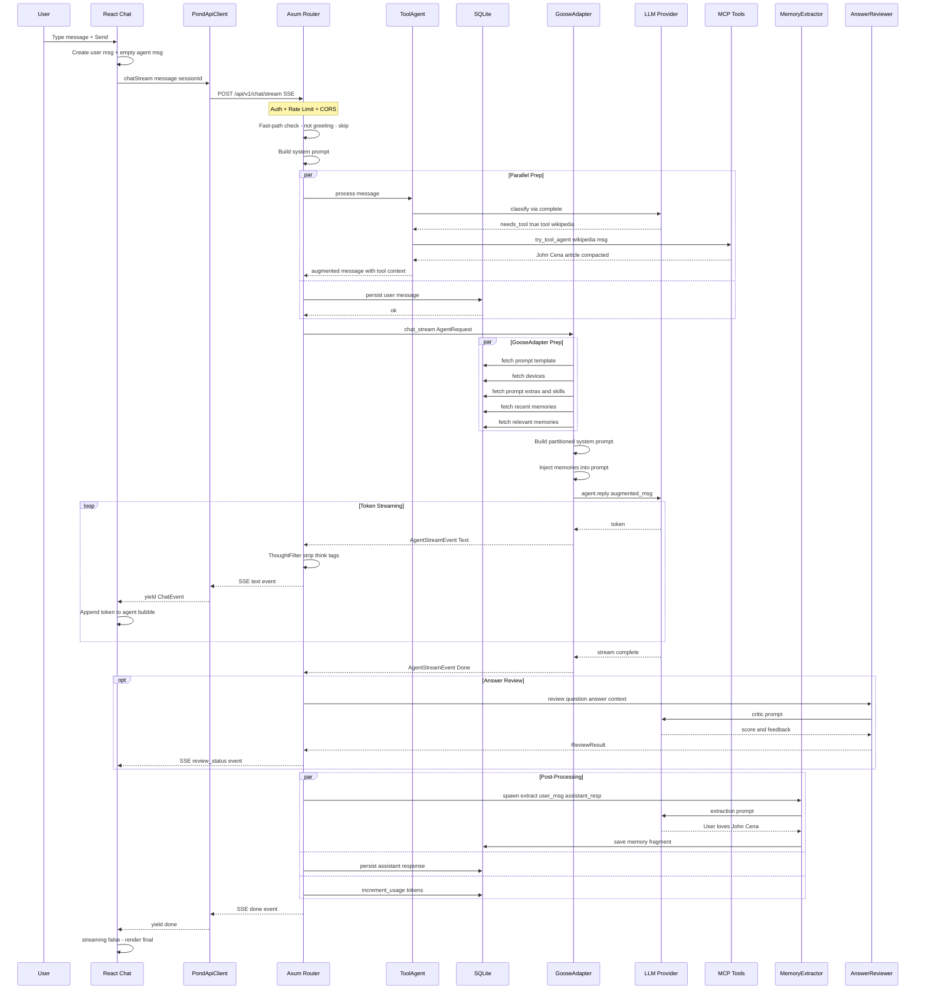
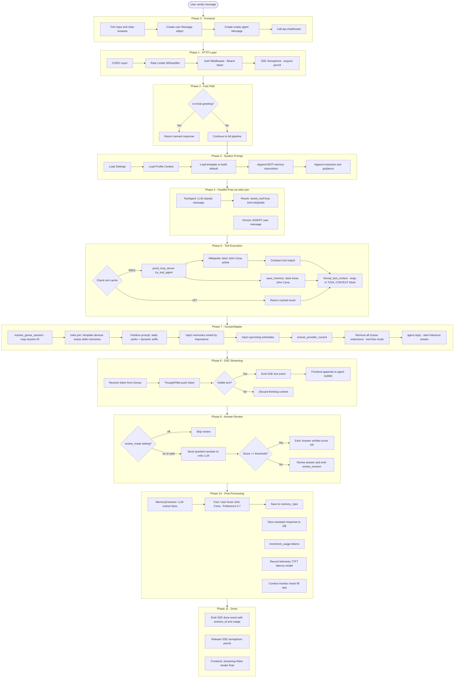
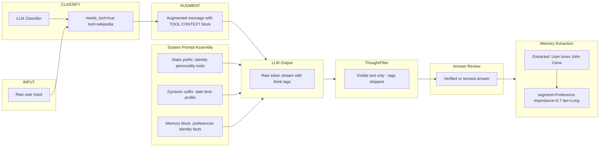
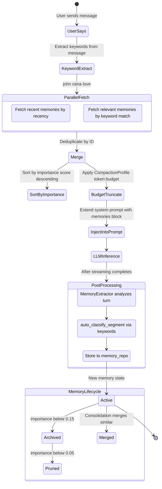

# Agent Loop Diagrams

Trace of a prompt like `"Who is John Cena, How Old is he and remember I love him!"` through the full GIAP pipeline.

---

## 1. High-Level Sequence Diagram

---

## 2. Phase Flowchart

---

## 3. Concurrency Model

```mermaid
gantt
    title Timeline for a single chat turn
    dateFormat X
    axisFormat %L ms

    section Phase 4 Parallel Prep
    ToolAgent LLM classify     :active, tc, 0, 400
    Persist user msg SQLite    :active, db, 0, 10

    section Phase 5 Tool Exec
    Wikipedia fetch and compact :tool1, 400, 800
    save_memory MCP            :tool2, 400, 500
    format_tool_context        :fmt, 800, 820

    section Phase 7 Goose Prep
    tokio join template devices memories extras skills :gp, 820, 900
    Build partitioned prompt   :bp, 900, 920
    Inject memories            :im, 920, 930

    section Phase 8 LLM Streaming
    Goose agent.reply          :crit, stream, 930, 8000
    ThoughtFilter and SSE emit :active, sse, 1200, 8000

    section Phase 9 Review
    Critic LLM call            :review, 8000, 9500

    section Phase 10 Post-Processing
    Memory extraction spawned  :active, mem, 8000, 10000
    Persist assistant msg      :persist, 9500, 9510
    Token usage and telemetry  :telem, 9510, 9530

    section Done
    SSE done event             :milestone, done, 9530, 9530
```

---

## 4. Data Transformation Pipeline

---

## 5. Memory Lifecycle for this turn

---

## Source file locations

| Phase | Primary file | Line |
|-------|-------------|------|
| Frontend send | `pond-desktop/src/sections/Chat.tsx` | 225 |
| API client SSE | `pond-desktop/src/api/PondApiClient.ts` | 395 |
| chat_stream handler | `crates/pond-api/src/routes.rs` | 526 |
| Fast-path check | `crates/pond-api/src/routes.rs` | 560 |
| System prompt build | `crates/pond-api/src/routes.rs` | 618 |
| Parallel prep tokio join | `crates/pond-api/src/routes.rs` | 722 |
| ToolAgent classify | `crates/pond-server/src/main.rs` | 2117 |
| Tool execution | `crates/pond-server/src/main.rs` | 2184 |
| GooseAdapter chat_stream | `crates/pond-adapters-goose/src/goose_agent.rs` | 469 |
| Memory injection | `crates/pond-adapters-goose/src/goose_agent.rs` | 668 |
| ThoughtFilter | `crates/pond-api/src/thought_filter.rs` | 1 |
| SSE event loop | `crates/pond-api/src/routes.rs` | 871 |
| Answer review | `crates/pond-api/src/routes.rs` | 962 |
| Memory extraction | `crates/pond-api/src/routes.rs` | 1020 |
| Persist + telemetry | `crates/pond-api/src/routes.rs` | 1036 |
| Done event | `crates/pond-api/src/routes.rs` | 1133 |
