# Database Schema — Goose In A Pond

> Version 0.2.0 | March 2026

## Overview

GIAP uses **two SQLite databases** to separate concerns:

| Database | File | Purpose |
|----------|------|---------|
| **System** | `pond_system.db` | Core app data — sessions, devices, users, preferences, routines |
| **Logs** | `pond_logs.db` | Telemetry, audit trail, privacy logs, sensor history |

Both are initialized via `sqlx::migrate!()` in `pond-infra/src/db.rs`. Migration files live at:
- `crates/pond-infra/migrations/system/`
- `crates/pond-infra/migrations/logs/`

---

## Current State (What Exists Today)

### System DB — `pond_system.db`

#### `onboarding_state`

Singleton row tracking onboarding progress.

| Column | Type | Constraints | Notes |
|--------|------|-------------|-------|
| `id` | INTEGER | PK, CHECK(id=1) | Forces single row |
| `current_step` | TEXT | NOT NULL | `VerifyDevice`, `CreateProfile`, `ConfigurePersonality`, `ConnectDevices`, `Completed` |
| `updated_at` | TEXT | NOT NULL, DEFAULT datetime('now') | |

#### `sessions`

Conversation sessions (one per chat interaction).

| Column | Type | Constraints |
|--------|------|-------------|
| `id` | TEXT | PK |
| `created_at` | TEXT | NOT NULL, DEFAULT datetime('now') |
| `updated_at` | TEXT | NOT NULL, DEFAULT datetime('now') |

#### `session_messages`

Individual messages within sessions.

| Column | Type | Constraints |
|--------|------|-------------|
| `id` | TEXT | PK |
| `session_id` | TEXT | NOT NULL, FK → sessions(id) ON DELETE CASCADE |
| `role` | TEXT | NOT NULL, CHECK(role IN ('user','assistant','system')) |
| `content` | TEXT | NOT NULL |
| `created_at` | TEXT | NOT NULL, DEFAULT datetime('now') |

Index: `idx_session_messages_session_id` on `(session_id)`

#### `devices`

Registered devices (currently minimal/placeholder).

| Column | Type | Constraints |
|--------|------|-------------|
| `id` | TEXT | PK |
| `name` | TEXT | NOT NULL |
| `hostname` | TEXT | Nullable |
| `created_at` | TEXT | NOT NULL, DEFAULT datetime('now') |
| `updated_at` | TEXT | NOT NULL, DEFAULT datetime('now') |

#### `settings`

Key-value store for **system-level** configuration only (LLM endpoint, port, data directory, etc.). User-facing preferences belong in `user_settings`.

| Column | Type | Constraints |
|--------|------|-------------|
| `key` | TEXT | PK |
| `value` | TEXT | NOT NULL |
| `updated_at` | TEXT | NOT NULL, DEFAULT datetime('now') |

### Logs DB — `pond_logs.db`

#### `event_log`

General-purpose event/logging table.

| Column | Type | Constraints |
|--------|------|-------------|
| `id` | INTEGER | PK AUTOINCREMENT |
| `timestamp` | TEXT | NOT NULL, DEFAULT datetime('now') |
| `level` | TEXT | NOT NULL, DEFAULT 'INFO' |
| `source` | TEXT | NOT NULL |
| `message` | TEXT | NOT NULL |
| `metadata` | TEXT | Nullable (JSON blob) |

#### `system_info`

Hardware/system telemetry snapshots.

| Column | Type | Constraints |
|--------|------|-------------|
| `id` | INTEGER | PK AUTOINCREMENT |
| `timestamp` | TEXT | NOT NULL, DEFAULT datetime('now') |
| `key` | TEXT | NOT NULL |
| `value` | TEXT | NOT NULL |

---

## Proposed Schema Additions

The following tables are designed to support the full Q1–Q4 roadmap from the proposal. Each table maps to a specific port, domain concept, or proposal feature. They are grouped by the quarter in which they become relevant.

---

### Q1 — Foundation & Core Prototype

> Most Q1 tables already exist. The following additions complete the foundation.

#### `user_profiles` ← System DB

Stores the primary user created during onboarding. Supports personalization (Q3) and multi-user (Q4).

| Column | Type | Constraints | Notes |
|--------|------|-------------|-------|
| `id` | TEXT | PK | UUID |
| `username` | TEXT | NOT NULL, UNIQUE | Set during `CreateProfile` onboarding step |
| `display_name` | TEXT | Nullable | Friendly name for TTS ("Hey Jerry") |
| `personality` | TEXT | NOT NULL DEFAULT 'friendly' | `friendly`, `professional`, `casual`, `funny`, `stoic` |
| `is_primary` | INTEGER | NOT NULL DEFAULT 1 | 1 = primary user, 0 = household member |
| `created_at` | TEXT | NOT NULL DEFAULT datetime('now') | |
| `updated_at` | TEXT | NOT NULL DEFAULT datetime('now') | |

**Rationale**: Currently the onboarding collects `username` and `personality` but discards them — they exist only in the CLI prompt flow. This table persists them so the system prompt can use them.

#### `user_settings` ← System DB

Per-user preferences, scoped to a `user_profiles` row. Separates user-facing customization from global system config in `settings`.

| Column | Type | Constraints | Notes |
|--------|------|-------------|-------|
| `id` | INTEGER | PK AUTOINCREMENT | |
| `user_id` | TEXT | NOT NULL, FK → user_profiles(id) ON DELETE CASCADE | |
| `key` | TEXT | NOT NULL | Setting name |
| `value` | TEXT | NOT NULL | Setting value |
| `updated_at` | TEXT | NOT NULL DEFAULT datetime('now') | |

Unique index: `idx_user_settings_user_key` on `(user_id, key)`

**Default settings seeded on profile creation:**

| Key | Default | Description |
|-----|---------|-------------|
| `wake_word` | `"goose"` | Custom wake word for this user |
| `temperature_unit` | `"celsius"` | `celsius` or `fahrenheit` |
| `language` | `"en"` | ISO 639-1 language code |
| `tts_voice` | `"default"` | Which TTS voice to use |
| `tts_speed` | `"1.0"` | Speech rate multiplier |
| `volume` | `"80"` | Output volume (0–100) |
| `notification_sounds` | `"true"` | Enable/disable notification audio |
| `privacy_mode` | `"standard"` | `standard` or `strict` (no network at all) |
| `dashboard_theme` | `"dark"` | `dark`, `light`, `auto` |
| `timezone` | `"UTC"` | IANA timezone (e.g. `Africa/Nairobi`) |

**Rationale**: The existing `settings` KV table has no concept of "which user". With household members and GOTG connections, each user needs their own preferences — one user might prefer Celsius while another uses Fahrenheit, and each might have a different wake word.

#### `system_prompts` ← System DB

Versioned system prompt history. Enables self-rewriting prompts (Q3) with rollback.

| Column | Type | Constraints | Notes |
|--------|------|-------------|-------|
| `id` | INTEGER | PK AUTOINCREMENT | |
| `content` | TEXT | NOT NULL | Full system prompt text |
| `is_active` | INTEGER | NOT NULL DEFAULT 0 | Only one row should have `is_active=1` |
| `created_by` | TEXT | NOT NULL DEFAULT 'system' | `system`, `user`, `agent` |
| `created_at` | TEXT | NOT NULL DEFAULT datetime('now') | |

**Rationale**: `prompts.rs` has a hardcoded `SYSTEM_PROMPT` constant. This table lets it become dynamic, loadable from DB, and versionable.

---

### Q2 — Smart Devices & Mobile Companion

#### `devices` (ENHANCED) ← System DB

Extends the existing `devices` table to match the `DeviceRegistry` port.

| Column | Type | Constraints | Notes |
|--------|------|-------------|-------|
| `id` | TEXT | PK | UUID |
| `name` | TEXT | NOT NULL | User-facing name ("Living Room TV") |
| `device_type` | TEXT | NOT NULL DEFAULT 'unknown' | `gotg`, `smart_speaker`, `sensor`, `ir_blaster`, `camera`, `pond`, `light`, `switch` |
| `hostname` | TEXT | Nullable | mDNS hostname or IP |
| `ip_address` | TEXT | Nullable | Direct IP if known |
| `mac_address` | TEXT | Nullable | For wake-on-LAN, BLE identification |
| `protocol` | TEXT | Nullable | `mqtt`, `zigbee`, `http`, `ir`, `bluetooth`, `adb` |
| `capabilities` | TEXT | NOT NULL DEFAULT '[]' | JSON array of capability strings |
| `room` | TEXT | Nullable | Logical grouping ("kitchen", "bedroom") |
| `is_online` | INTEGER | NOT NULL DEFAULT 0 | Last known status |
| `last_seen` | TEXT | Nullable | Last heartbeat timestamp |
| `metadata` | TEXT | Nullable | JSON blob for protocol-specific config |
| `registered_at` | TEXT | NOT NULL DEFAULT datetime('now') | |
| `updated_at` | TEXT | NOT NULL DEFAULT datetime('now') | |

Index: `idx_devices_room` on `(room)`
Index: `idx_devices_type` on `(device_type)`

#### `auth_tokens` ← System DB

Maps to the `Handshake` port. Stores session tokens for authenticated GOTG/client connections.

| Column | Type | Constraints | Notes |
|--------|------|-------------|-------|
| `id` | INTEGER | PK AUTOINCREMENT | |
| `token` | TEXT | NOT NULL, UNIQUE | The session token (cryptographic random) |
| `client_id` | TEXT | NOT NULL | Client's UUID (mobile device, CLI, etc.) |
| `client_type` | TEXT | NOT NULL | `gotg`, `pond`, `cli`, `web` |
| `client_version` | TEXT | Nullable | Client software version |
| `device_id` | TEXT | Nullable | FK → devices(id) if linked to a registered device |
| `issued_at` | TEXT | NOT NULL DEFAULT datetime('now') | |
| `expires_at` | TEXT | Nullable | NULL = never expires |
| `revoked` | INTEGER | NOT NULL DEFAULT 0 | 1 = revoked |
| `last_used` | TEXT | Nullable | Updated on each API call |

Index: `idx_auth_tokens_token` on `(token)`
Index: `idx_auth_tokens_client_id` on `(client_id)`

#### `notifications` ← System DB

Maps to the `NotificationSender` port. Persists notifications for delivery and history.

| Column | Type | Constraints | Notes |
|--------|------|-------------|-------|
| `id` | TEXT | PK | UUID |
| `target` | TEXT | NOT NULL | Device ID or `broadcast` |
| `category` | TEXT | NOT NULL DEFAULT 'info' | `alert`, `info`, `action_required`, `security` |
| `title` | TEXT | NOT NULL | |
| `body` | TEXT | NOT NULL | |
| `data` | TEXT | Nullable | JSON payload |
| `delivered` | INTEGER | NOT NULL DEFAULT 0 | 1 = successfully delivered |
| `acknowledged` | INTEGER | NOT NULL DEFAULT 0 | 1 = client confirmed receipt |
| `created_at` | TEXT | NOT NULL DEFAULT datetime('now') | |
| `delivered_at` | TEXT | Nullable | |

Index: `idx_notifications_target` on `(target)`

#### `device_commands` ← System DB

Command history for smart devices (lights, switches, IR, etc.). Useful for replay, debugging, and undo.

| Column | Type | Constraints | Notes |
|--------|------|-------------|-------|
| `id` | INTEGER | PK AUTOINCREMENT | |
| `device_id` | TEXT | NOT NULL, FK → devices(id) | Target device |
| `command` | TEXT | NOT NULL | e.g. `turn_on`, `set_brightness`, `ir_send` |
| `payload` | TEXT | Nullable | JSON parameters |
| `status` | TEXT | NOT NULL DEFAULT 'pending' | `pending`, `sent`, `success`, `failed` |
| `error` | TEXT | Nullable | Error message if failed |
| `issued_by` | TEXT | NOT NULL DEFAULT 'agent' | `agent`, `user`, `routine`, `schedule` |
| `created_at` | TEXT | NOT NULL DEFAULT datetime('now') | |

---

### Q3 — Self-Improving Agent & Security

#### `memory` ← System DB

Agent memory store. Maps to Goose's Memory MCP concept — persistent key-value knowledge.

| Column | Type | Constraints | Notes |
|--------|------|-------------|-------|
| `id` | INTEGER | PK AUTOINCREMENT | |
| `category` | TEXT | NOT NULL DEFAULT 'general' | `preference`, `device_alias`, `routine`, `fact`, `correction` |
| `key` | TEXT | NOT NULL | Lookup key ("tv" → "living room television") |
| `value` | TEXT | NOT NULL | The remembered fact or preference |
| `confidence` | REAL | NOT NULL DEFAULT 1.0 | 0.0–1.0; decreases on contradictions |
| `source` | TEXT | NOT NULL DEFAULT 'user' | `user`, `agent`, `inferred` |
| `times_used` | INTEGER | NOT NULL DEFAULT 0 | How often retrieved in conversations |
| `created_at` | TEXT | NOT NULL DEFAULT datetime('now') | |
| `updated_at` | TEXT | NOT NULL DEFAULT datetime('now') | |

Unique index: `idx_memory_category_key` on `(category, key)`

**Use cases**:
- "Goose, remember that TV means the living room Samsung" → `(device_alias, "tv", "living room Samsung")`
- "I prefer Celsius" → `(preference, "temperature_unit", "celsius")`
- "Goose, forget this" → DELETE from memory

#### `routines` ← System DB

User-defined automations (maps to Local Routine/Scheduler MCP from proposal).

| Column | Type | Constraints | Notes |
|--------|------|-------------|-------|
| `id` | TEXT | PK | UUID |
| `name` | TEXT | NOT NULL | Human-readable ("Morning Routine") |
| `trigger_type` | TEXT | NOT NULL | `time`, `sensor`, `voice`, `event` |
| `trigger_config` | TEXT | NOT NULL | JSON: `{"cron":"0 7 * * *"}` or `{"sensor":"motion","zone":"backyard","condition":"after_sunset"}` |
| `actions` | TEXT | NOT NULL | JSON array: `[{"device":"light_1","command":"turn_on"},{"command":"speak","text":"Good morning"}]` |
| `enabled` | INTEGER | NOT NULL DEFAULT 1 | 0 = disabled |
| `last_run` | TEXT | Nullable | |
| `run_count` | INTEGER | NOT NULL DEFAULT 0 | |
| `created_at` | TEXT | NOT NULL DEFAULT datetime('now') | |
| `updated_at` | TEXT | NOT NULL DEFAULT datetime('now') | |

#### `feedback` ← System DB

User feedback loop for self-improvement (upvote/downvote/corrections).

| Column | Type | Constraints | Notes |
|--------|------|-------------|-------|
| `id` | INTEGER | PK AUTOINCREMENT | |
| `session_id` | TEXT | Nullable, FK → sessions(id) | Which conversation |
| `message_id` | TEXT | Nullable, FK → session_messages(id) | Which specific response |
| `rating` | INTEGER | Nullable | -1 = downvote, +1 = upvote |
| `correction` | TEXT | Nullable | User-provided correct answer |
| `comment` | TEXT | Nullable | Free-form feedback |
| `created_at` | TEXT | NOT NULL DEFAULT datetime('now') | |

#### `prompt_rewrites` ← Logs DB

Audit trail for self-rewriting prompts. Every time the agent modifies its own system prompt, record what changed and why.

| Column | Type | Constraints | Notes |
|--------|------|-------------|-------|
| `id` | INTEGER | PK AUTOINCREMENT | |
| `prompt_id` | INTEGER | NOT NULL | References system_prompts(id) |
| `reason` | TEXT | NOT NULL | Why the rewrite happened |
| `diff` | TEXT | Nullable | Textual diff of old→new |
| `triggered_by` | TEXT | NOT NULL DEFAULT 'agent' | `agent`, `user`, `feedback` |
| `created_at` | TEXT | NOT NULL DEFAULT datetime('now') | |

---

### Q3 — Security Integration

#### `camera_events` ← Logs DB

Local vision event log (maps to Local Vision Event Detection MCP).

| Column | Type | Constraints | Notes |
|--------|------|-------------|-------|
| `id` | INTEGER | PK AUTOINCREMENT | |
| `camera_id` | TEXT | NOT NULL | FK → devices(id) |
| `event_type` | TEXT | NOT NULL | `motion`, `person`, `pet`, `package`, `vehicle`, `unusual` |
| `confidence` | REAL | Nullable | Model confidence score |
| `snapshot_path` | TEXT | Nullable | Local path to captured frame |
| `metadata` | TEXT | Nullable | JSON (bounding boxes, zone info, etc.) |
| `acknowledged` | INTEGER | NOT NULL DEFAULT 0 | 1 = user has seen it |
| `created_at` | TEXT | NOT NULL DEFAULT datetime('now') | |

Index: `idx_camera_events_type` on `(event_type)`
Index: `idx_camera_events_camera` on `(camera_id)`

#### `sensor_readings` ← Logs DB

Time-series sensor data (maps to Sensor Data Aggregator MCP).

| Column | Type | Constraints | Notes |
|--------|------|-------------|-------|
| `id` | INTEGER | PK AUTOINCREMENT | |
| `device_id` | TEXT | NOT NULL | FK → devices(id) |
| `sensor_type` | TEXT | NOT NULL | `temperature`, `humidity`, `motion`, `door`, `energy`, `light_level` |
| `value` | REAL | NOT NULL | Numeric reading |
| `unit` | TEXT | NOT NULL | `°C`, `%`, `boolean`, `kWh`, `lux` |
| `created_at` | TEXT | NOT NULL DEFAULT datetime('now') | |

Index: `idx_sensor_readings_device_type` on `(device_id, sensor_type)`

> [!TIP]
> For high-frequency sensor data, consider periodic pruning (e.g., keep raw data for 30 days, then aggregate to hourly averages). This keeps the logs DB manageable on embedded hardware.

---

### Q4 — Community Release & Ecosystem

#### `mcp_extensions` ← System DB

Registry of installed MCP servers/extensions.

| Column | Type | Constraints | Notes |
|--------|------|-------------|-------|
| `id` | TEXT | PK | Unique extension identifier |
| `name` | TEXT | NOT NULL | Human-readable name |
| `version` | TEXT | NOT NULL | Semver |
| `description` | TEXT | Nullable | |
| `endpoint` | TEXT | Nullable | Local URL if runs as HTTP server |
| `config` | TEXT | Nullable | JSON configuration |
| `enabled` | INTEGER | NOT NULL DEFAULT 1 | |
| `installed_at` | TEXT | NOT NULL DEFAULT datetime('now') | |
| `updated_at` | TEXT | NOT NULL DEFAULT datetime('now') | |

#### `privacy_audit_log` ← Logs DB

Maps to the Local Privacy Audit/Logs MCP. Tracks what Goose did and any data-leave-device events.

| Column | Type | Constraints | Notes |
|--------|------|-------------|-------|
| `id` | INTEGER | PK AUTOINCREMENT | |
| `action` | TEXT | NOT NULL | `inference`, `device_command`, `network_request`, `file_access`, `audio_capture` |
| `target` | TEXT | Nullable | What was acted upon (device name, URL, file path) |
| `detail` | TEXT | Nullable | JSON: model used, tokens, duration, etc. |
| `risk_level` | TEXT | NOT NULL DEFAULT 'none' | `none`, `low`, `medium`, `high` |
| `created_at` | TEXT | NOT NULL DEFAULT datetime('now') | |

Index: `idx_privacy_audit_risk` on `(risk_level)`

**Example queries the user can ask:**
- "What did Goose do last hour?" → `SELECT * FROM privacy_audit_log WHERE created_at > datetime('now', '-1 hour')`
- "Show me high-risk actions" → `SELECT * FROM privacy_audit_log WHERE risk_level = 'high'`

---

## Entity-Relationship Diagram

```mermaid
erDiagram
    user_profiles ||--o{ sessions : "has"
    user_profiles ||--o{ user_settings : "configures"
    sessions ||--o{ session_messages : "contains"
    sessions ||--o{ feedback : "receives"
    session_messages ||--o{ feedback : "rated_by"

    devices ||--o{ device_commands : "receives"
    devices ||--o{ sensor_readings : "produces"
    devices ||--o{ camera_events : "detects"
    devices ||--o{ auth_tokens : "linked_to"

    routines ||--o{ device_commands : "triggers"

    user_profiles {
        text id PK
        text username
        text personality
        integer is_primary
    }

    user_settings {
        integer id PK
        text user_id FK
        text key
        text value
    }

    sessions {
        text id PK
        text created_at
    }

    session_messages {
        text id PK
        text session_id FK
        text role
        text content
    }

    devices {
        text id PK
        text name
        text device_type
        text protocol
        text room
        integer is_online
    }

    auth_tokens {
        integer id PK
        text token
        text client_id
        text client_type
        integer revoked
    }

    notifications {
        text id PK
        text target
        text category
        text title
    }

    memory {
        integer id PK
        text category
        text key
        text value
        real confidence
    }

    routines {
        text id PK
        text name
        text trigger_type
        text actions
        integer enabled
    }

    feedback {
        integer id PK
        text session_id FK
        integer rating
        text correction
    }

    system_prompts {
        integer id PK
        text content
        integer is_active
    }

    device_commands {
        integer id PK
        text device_id FK
        text command
        text status
    }

    mcp_extensions {
        text id PK
        text name
        text version
        integer enabled
    }

    sensor_readings {
        integer id PK
        text device_id FK
        text sensor_type
        real value
    }

    camera_events {
        integer id PK
        text camera_id FK
        text event_type
        real confidence
    }

    privacy_audit_log {
        integer id PK
        text action
        text risk_level
    }

    prompt_rewrites {
        integer id PK
        integer prompt_id FK
        text reason
    }

    onboarding_state {
        integer id PK
        text current_step
    }

    settings {
        text key PK
        text value
        text note "system-only"
    }

    event_log {
        integer id PK
        text level
        text source
        text message
    }

    system_info {
        integer id PK
        text key
        text value
    }
```

---

## Port → Table Mapping

This shows which database table(s) back each port defined in `pond-core/src/ports/`:

| Port Trait | Tables | DB | Status |
|-----------|--------|-----|--------|
| `OnboardingRepository` | `onboarding_state` | System | ✅ Exists |
| `SessionStorage` | `sessions`, `session_messages` | System | ✅ Exists |
| `Storage` | `settings` (system-only) | System | ✅ Exists (unused) |
| *Future: UserSettingsStore* | `user_settings`, `user_profiles` | System | 🔴 New port needed |
| `DeviceRegistry` | `devices`, `device_commands` | System | 🔶 Table exists, needs enhancement |
| `Handshake` | `auth_tokens`, `devices` | System | 🔴 New |
| `NotificationSender` | `notifications` | System | 🔴 New |
| `LlmProvider` | — (stateless HTTP calls) | — | ✅ No table needed |
| `VoiceInput` | — (real-time audio processing) | — | ✅ No table needed |
| `Agent` | — (delegates to LlmProvider) | — | ✅ No table needed |
| *Future: MemoryStore* | `memory` | System | 🔴 New port needed |
| *Future: RoutineScheduler* | `routines` | System | 🔴 New port needed |
| *Future: FeedbackCollector* | `feedback` | System | 🔴 New port needed |
| *Future: PromptManager* | `system_prompts`, `prompt_rewrites` | System+Logs | 🔴 New port needed |
| *Future: SensorAggregator* | `sensor_readings` | Logs | 🔴 New port needed |
| *Future: VisionDetector* | `camera_events` | Logs | 🔴 New port needed |
| *Future: PrivacyAuditor* | `privacy_audit_log` | Logs | 🔴 New port needed |
| *Future: ExtensionRegistry* | `mcp_extensions` | System | 🔴 New port needed |

---

## Migration Strategy

> [!IMPORTANT]
> All new tables should be added as **new migration files** (e.g., `0002_user_profiles.sql`, `0003_devices_v2.sql`). Never edit `0001_initial.sql` — existing databases depend on it.

### Recommended migration order

1. **`0002_user_profiles.sql`** (System) — Unblocks personalized system prompts
2. **`0002_user_settings.sql`** (System) — Per-user preferences (wake word, language, theme, etc.)
3. **`0002_system_prompts.sql`** (System) — Dynamic system prompt loading
3. **`0003_devices_v2.sql`** (System) — ALTER TABLE to add new columns to `devices`
4. **`0003_auth_tokens.sql`** (System) — Unblocks handshake protocol (Task 0.15)
5. **`0004_notifications.sql`** (System) — Unblocks GOTG push notifications
6. **`0004_device_commands.sql`** (System) — Unblocks smart device control audit
7. **`0005_memory.sql`** (System) — Unblocks Q3 memory feature
8. **`0005_routines.sql`** (System) — Unblocks Q2-Q3 automation
9. **`0006_feedback.sql`** (System) — Unblocks Q3 self-improvement
10. **`0002_sensor_readings.sql`** (Logs) — Sensor time-series data
11. **`0002_camera_events.sql`** (Logs) — Vision event detection
12. **`0003_privacy_audit.sql`** (Logs) — Privacy audit trail
13. **`0003_prompt_rewrites.sql`** (Logs) — Prompt rewrite audit
14. **`0007_mcp_extensions.sql`** (System) — Extension registry for Q4

---

## Design Decisions & Tradeoffs

### Why SQLite (not Postgres, not SurrealDB)?

1. **Local-first**: No external database server needed — critical for Jetson/embedded deployment
2. **Zero config**: `sqlx::migrate!()` handles everything at startup
3. **Single file**: Easy backup (`cp pond_system.db pond_system.db.bak`)
4. **Already in use**: Sessions and onboarding are working — minimal migration risk

### Why two databases?

1. **Separation of concerns**: System data (devices, settings) vs observability data (logs, telemetry)
2. **Independent lifecycle**: Logs can be pruned/rotated without touching system data
3. **Performance**: High-frequency sensor writes don't contend with application queries

### Why TEXT for timestamps (not INTEGER unix epoch)?

1. **Human-readable**: `datetime('now')` produces `2026-03-25 08:44:59` — easy to debug
2. **SQLite native**: All SQLite datetime functions work on TEXT format
3. **Consistency**: All existing tables already use this convention

> [!WARNING]
> SQLite's `datetime('now')` has 1-second resolution. For tables with high insertion rates (`sensor_readings`, `event_log`), always sort by `rowid ASC` as a secondary tiebreaker.

### Why JSON blobs for capabilities/actions/metadata?

1. **Flexibility**: Device capabilities and routine actions vary wildly between device types
2. **No joins needed**: These are read-as-blob, not queried relationally
3. **SQLite JSON1**: SQLite has built-in `json_extract()` for occasional queries

> [!CAUTION]
> Do NOT store relational data in JSON blobs. If you find yourself writing `json_extract()` frequently, it's time to normalize into a proper table.

---

## Alternative Schemas Considered

### Option A: Single unified database
- **Pro**: Simpler code (one connection pool)
- **Con**: Logs bloat affects system query performance; no independent pruning
- **Decision**: Rejected — dual-DB matches proposal's privacy audit requirements

### Option B: Separate DB per feature (sessions.db, devices.db, memory.db...)
- **Pro**: Maximum isolation
- **Con**: Connection pool explosion, complex transaction coordination, overkill for SQLite
- **Decision**: Rejected — two databases is the right balance

### Option C: Replace key-value `settings` with typed columns
- **Pro**: Type safety, schema validation
- **Con**: Every new setting requires a migration
- **Decision**: Keep KV for now — the flexibility outweighs the type safety loss at this stage

### Option D: Time-series DB (InfluxDB, TimescaleDB) for sensor data
- **Pro**: Purpose-built for time-series queries
- **Con**: External dependency, violates local-first/zero-config principle
- **Decision**: Rejected for MVP — can be reconsidered for Q4 if sensor data volume justifies it
