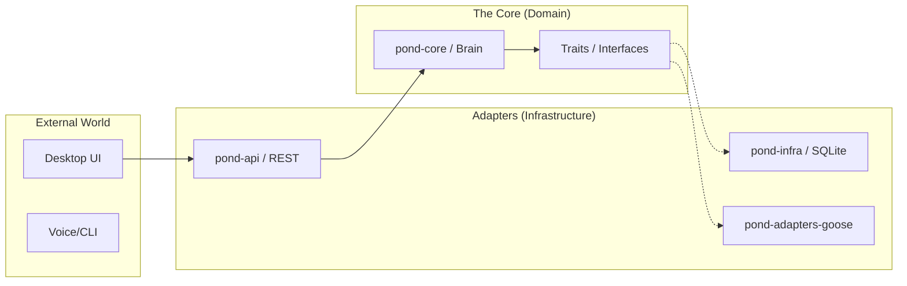

# Architecture Overview: Hexagonal (Ports & Adapters)

## 1. Core Philosophy
The core logic of **Goose-in-a-Pond** is isolated from external concerns. We treat frameworks (like `goose`), databases (like `SQLite`), and communication channels (like `REST/Websockets`) as **interchangeable plugins**.

This is built using the **Hexagonal Architecture** (also known as Ports & Adapters).

---

## 2. High-Level Diagram

---

## 3. The Three Layers

### A. The Core (`pond-core`)
The center of the hexagon. It contains the **Business Rules**.
- **Source of Truth**: Defines how the assistant makes decisions.
- **Dependency Rule**: Must not depend on any crate from the Infrastructure or API layers.
- **Ports**: Defines Rust `traits` that represent external capabilities (e.g., `trait AgentBackend`, `trait Storage`).

### B. Adapters (`pond-adapters-*`, `pond-infra`)
The implementations of the Ports.
- **Driver Adapters**: These trigger actions in the core (e.g., a REST request from the UI).
- **Driven Adapters**: These are called by the core to perform tasks (e.g., saving to a database or asking Goose a question).

### C. The API (`pond-api`)
The shared language between the Backend and the Frontend.
- Contains DTOs (Data Transfer Objects) and serialization logic.

---

## 4. Why This Architecture?

| Benefit | Description |
| :--- | :--- |
| **Testability** | We can test core logic by "plugging in" mock adapters without needing a real AI engine or DB. |
| **Flexibility** | If we want to replace `goose` with another agent framework, we only change the `pond-adapters-goose` crate. |
| **Maintainability** | Clear boundaries prevent the "Spaghetti Code" where UI logic mixes with database queries. |
| **Agentic Focus** | The assistant's "memory" and "will" are central and protected from framework-specific quirks. |
