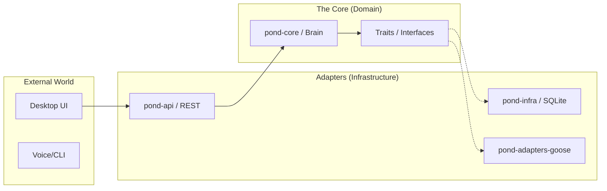
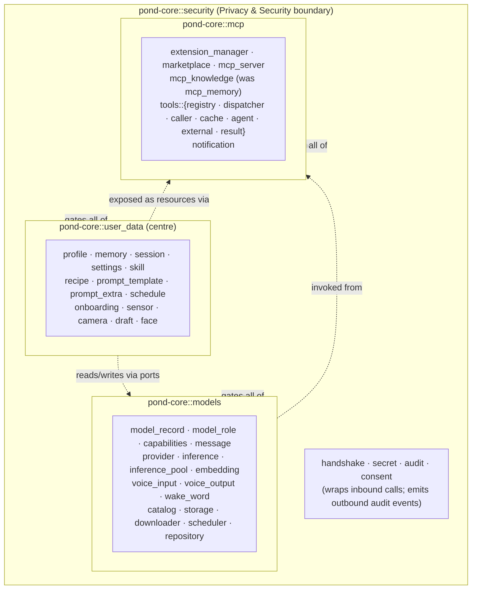

# Architecture Overview: Hexagonal (Ports & Adapters)

## 1. Core Philosophy
The core logic of **Goose-in-a-Pond** is isolated from external concerns. We treat frameworks (like `goose`), databases (like `SQLite`), and communication channels (like `REST/Websockets`) as **interchangeable plugins**.

This is built using the **Hexagonal Architecture** (also known as Ports & Adapters).

---

## 2. High-Level Diagram



---

## 2b. `pond-core` Four-Quadrant Layout

Inside the core, files are grouped into four quadrants around the user, plus a
`shared/` module for agent-loop plumbing that belongs to none of them. Each
quadrant has its own `domain/`, `ports/`, and `services/` (and a `mocks/` for
test doubles).



The arrows are conceptual, not new dependencies — they describe how a request
flows through the core. `shared/` (agent, chat loop, stdin/print IO) is used by
all quadrants and lives outside them.

| Quadrant | Holds |
| :--- | :--- |
| `user_data` | Facts about / owned by the household: profile, memory, sessions, settings, skills, recipes, prompts, schedules, sensors, drafts, faces |
| `models` | Anything that runs or routes inference: LLM providers, the model catalog, inference pool, ASR/TTS, embeddings, context budgeting |
| `mcp` | The tool surface: MCP servers, tool registry/dispatcher/caller/cache, extensions, marketplace, knowledge store |
| `security` | Secrets, handshake/auth, audit/telemetry, consent — the enclosing boundary |
| `shared` | Agent-loop plumbing used by every quadrant (agent types, chat loop, IO) |

---

## 3. The Three Layers

### A. The Core (`pond-core`)
The center of the hexagon. It contains the **Business Rules**.
- **Source of Truth**: Defines how the assistant makes decisions.
- **Dependency Rule**: Must not depend on any crate from the Infrastructure or API layers.
- **Ports**: Defines Rust `traits` that represent external capabilities (e.g., `trait AgentBackend`, `trait Storage`).

### B. Adapters (`pond-adapters-*`, `pond-infra`)
The implementations of the Ports.
- **Driver Adapters**: These trigger actions in the core (e.g., a REST request from the UI).
- **Driven Adapters**: These are called by the core to perform tasks (e.g., saving to a database or asking Goose a question).

### C. The API (`pond-api`)
The shared language between the Backend and the Frontend.
- Contains DTOs (Data Transfer Objects) and serialization logic.

---

## 4. Why This Architecture?

| Benefit | Description |
| :--- | :--- |
| **Testability** | We can test core logic by "plugging in" mock adapters without needing a real AI engine or DB. |
| **Flexibility** | If we want to replace `goose` with another agent framework, we only change the `pond-adapters-goose` crate. |
| **Maintainability** | Clear boundaries prevent the "Spaghetti Code" where UI logic mixes with database queries. |
| **Agentic Focus** | The assistant's "memory" and "will" are central and protected from framework-specific quirks. |

---

## 5. Detailed ASCII Architecture Map (2026-04-10)

```
╔══════════════════════════════════════════════════════════════════════════════╗
║                        EXTERNAL INTERFACES                                   ║
║                                                                              ║
║   CLI (pond-server …)    REST API clients    Web Dashboard    GOTG Mobile   ║
║   status/chat/serve      curl / web app      React SPA        companion app ║
╚═══════════════╤═══════════════╤═════════════════╤══════════════╤═════════════╝
                │               │                 │              │
╔═══════════════▼═══════════════▼═════════════════▼══════════════▼═════════════╗
║                       pond-server  (binary entry point)                      ║
║                                                                              ║
║  Subcommands: serve · chat · status · setup · onboard · agent                ║
║  models · prompts · skills · recipes · memories                              ║
║  Wires all Arc<dyn Port> together, starts Axum server                       ║
╚═══════════════════════════════════╤════════════════════════════════════════════╝
                                    │
╔═══════════════════════════════════▼════════════════════════════════════════════╗
║                         pond-api  (Axum HTTP layer)                           ║
║                                                                               ║
║  AppState (all Arc<dyn Port> fields)          REST Routes                    ║
║  Auth middleware (Bearer token)               /api/v1/health                 ║
║  DTOs (JSON request/response shapes)          /api/v1/chat                   ║
║                                               /api/v1/settings               ║
║                                               /api/v1/models                 ║
║                                               /api/v1/prompts                ║
║                                               /api/v1/skills                 ║
║                                               /api/v1/memories               ║
║                                               /api/v1/recipes                ║
║                                               /api/v1/agent                  ║
╚═══════════════════════════════════╤════════════════════════════════════════════╝
                                    │  Arc<dyn Port> (trait objects only)
╔═══════════════════════════════════▼════════════════════════════════════════════╗
║                     pond-core  ← THE BRAIN (no framework deps)               ║
║                                                                               ║
║  Four quadrants around the user, each with domain/ ports/ services/ mocks/   ║
║  ┌─────────────────────────────┐  ┌──────────────────────────────────────┐   ║
║  │  user_data/   (the centre)  │  │  models/                             │   ║
║  │  profile · memory · session │  │  message · model_record · capabilities│  ║
║  │  settings · skill · recipe  │  │  provider · inference · inference_pool│  ║
║  │  prompt_template/extra      │  │  embedding · voice_input/output      │   ║
║  │  schedule · onboarding      │  │  wake_word · catalog · downloader    │   ║
║  │  sensor · camera · draft    │  │  prompt_builder · context_budget     │   ║
║  │  face                       │  │  history_manager · thought_filter    │   ║
║  └─────────────────────────────┘  └──────────────────────────────────────┘   ║
║  ┌─────────────────────────────┐  ┌──────────────────────────────────────┐   ║
║  │  mcp/                       │  │  security/   (enclosing boundary)    │   ║
║  │  extension_manager          │  │  secret · handshake                  │   ║
║  │  marketplace · mcp_server   │  │  telemetry · event_log · policy      │   ║
║  │  mcp_knowledge              │  │  turn_metrics · oauth_provider       │   ║
║  │  tools::{registry·dispatcher│  └──────────────────────────────────────┘   ║
║  │   ·caller·cache·agent}      │  ┌──────────────────────────────────────┐   ║
║  │  notification               │  │  shared/  (agent-loop plumbing)      │   ║
║  └─────────────────────────────┘  │  agent · chat (run_loop)             │   ║
║                                   │  stdin_input · print_output          │   ║
║  Wait → Listen → Thinking → Speak │                                      │   ║
║  state machine in ChatService     └──────────────────────────────────────┘   ║
╚══════════════╤══════════════════════════════════════════════════════════════════╝
               │  implements Arc<dyn Port>
┌──────────────┴───────────────────────────────────────────────────────────────┐
│                           ADAPTERS                                           │
│                                                                              │
│ ┌───────────────────────────┐  ┌──────────────────────────────────────────┐ │
│ │  pond-adapters-goose      │  │  pond-server/                            │ │
│ │  (workspace excluded)     │  │  composite_model_catalog_provider.rs     │ │
│ │                           │  │   ├─ StaticModelCatalogProvider          │ │
│ │  GooseAdapter  ←primary── │  │   │   Whisper (9) · Piper TTS (9+1)     │ │
│ │   inference path          │  │   │   Llamafile (5) · GGUF (14)         │ │
│ │  GooseProviderAdapter     │  │   └─ OllamaCatalogProvider               │ │
│ │  GiapProviderShim         │  │       → http://localhost:11434/api/tags  │ │
│ │  GiapGooseExtensionMgr    │  └──────────────────────────────────────────┘ │
│ │  GiapRegistration         │                                              │ │
│ └───────────┬───────────────┘  ┌──────────────────────────────────────────┐ │
│             │uses              │  pond-adapters-llamafile                  │ │
│   ┌─────────▼──────────┐      │  (HTTP fallback for non-Goose CLI chat)   │ │
│   │  goose/ submodule  │      └──────────────────────────────────────────┘ │
│   │  (nested Cargo.toml│      ┌──────────────────────────────────────────┐ │
│   │   not in workspace)│      │  pond-adapters-whisper                   │ │
│   │                    │      │  WhisperInput · WhisperKeywordDetector    │ │
│   │  OllamaProvider    │      └──────────────────────────────────────────┘ │
│   │  LocalInference    │      ┌──────────────────────────────────────────┐ │
│   │  OpenAICompat      │      │  pond-adapters-piper  (TTS)              │ │
│   │  + all cloud LLMs  │      │  PiperOutput                             │ │
│   └────────────────────┘      └──────────────────────────────────────────┘ │
│                                ┌──────────────────────────────────────────┐ │
│ ┌──────────────────────────┐   │  pond-adapters-weather                   │ │
│ │  pond-mcp-server          │  │  OpenMeteoWeatherAdapter (15min TTL)     │ │
│ │  (workspace excluded)     │  └──────────────────────────────────────────┘ │
│ │  GiapMcpServer (9 tools)  │  ┌──────────────────────────────────────────┐ │
│ │   giap__get_current_      │  │  pond-adapters-mcp-memory (feature flag) │ │
│ │     weather               │  │  GooseMcpMemoryAdapter                   │ │
│ │   giap__list_devices      │  └──────────────────────────────────────────┘ │
│ │   giap__list_schedules    │  ┌──────────────────────────────────────────┐ │
│ │   giap__get_user_profile  │  │  pond-adapters-local-inference (feature) │ │
│ │   giap__get_model_        │  │  LocalInferenceProvider (in-proc GGUF)   │ │
│ │     assignments           │  └──────────────────────────────────────────┘ │
│ │   giap__recall_memories   │  ┌──────────────────────────────────────────┐ │
│ │   giap__save_memory       │  │  pond-adapters-gotg                      │ │
│ │   giap__get_recipe        │  │  GotgNotificationAdapter                 │ │
│ │   giap__list_skills       │  └──────────────────────────────────────────┘ │
│ │  GiapServiceHandles       │                                              │ │
│ │  (OnceLock global)        │                                              │ │
│ └───────────────────────────┘                                              │ │
└──────────────────────────────────────────────────────────────────────────────┘
               │  implements Arc<dyn Port>
╔══════════════▼═══════════════════════════════════════════════════════════════╗
║                      pond-infra  (SQLite persistence)                        ║
║                                                                              ║
║  Database::init(data_dir) → { system: Pool, logs: Pool }                   ║
║                                                                              ║
║  pond_system.db                     pond_logs.db                            ║
║  ├─ settings                        ├─ event_log                            ║
║  ├─ sessions + session_messages      ├─ system_info                         ║
║  ├─ onboarding_state                ├─ sensor_readings                      ║
║  ├─ devices                         └─ camera_events                        ║
║  ├─ models + model_role_assignments                                         ║
║  ├─ prompt_templates                     pond-infra-scheduler               ║
║  ├─ prompt_extras                        CronSchedulerAdapter               ║
║  ├─ user_skills                          schedules.json + WebhookExecutor   ║
║  ├─ agent_recipes                                                           ║
║  └─ memory_fragments                                                        ║
╚══════════════════════════════════════════════════════════════════════════════╝
```

**Key design rules:**
- `pond-core` has zero external framework imports — pure Rust traits and domain types
- All coupling is via `Arc<dyn Port>` — core never knows what adapter is wired
- Goose-dependent crates (`pond-adapters-goose`, `pond-mcp-server`) are **excluded from the workspace** due to `rmcp` version conflict
- `CompositeModelCatalogProvider` replaced the deleted `registry.json` approach with static curated lists + live Ollama query
