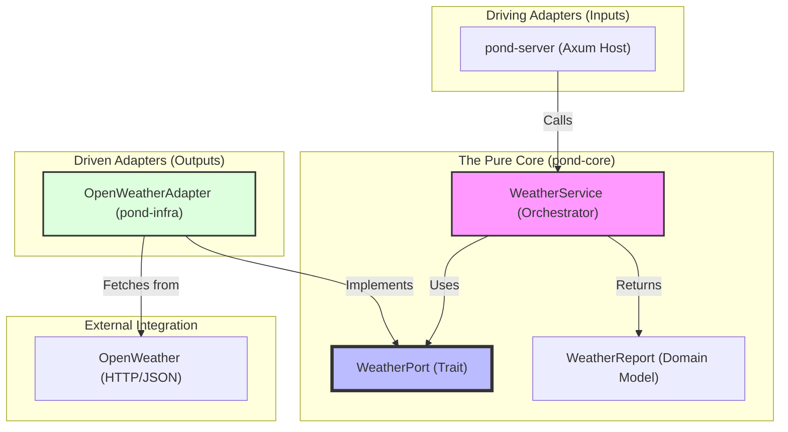
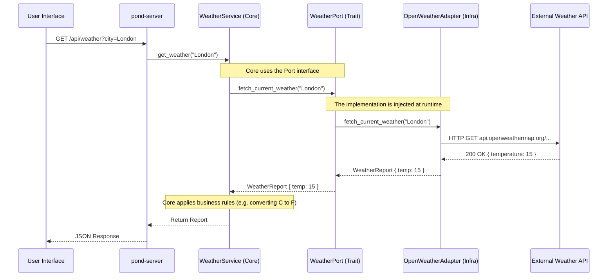
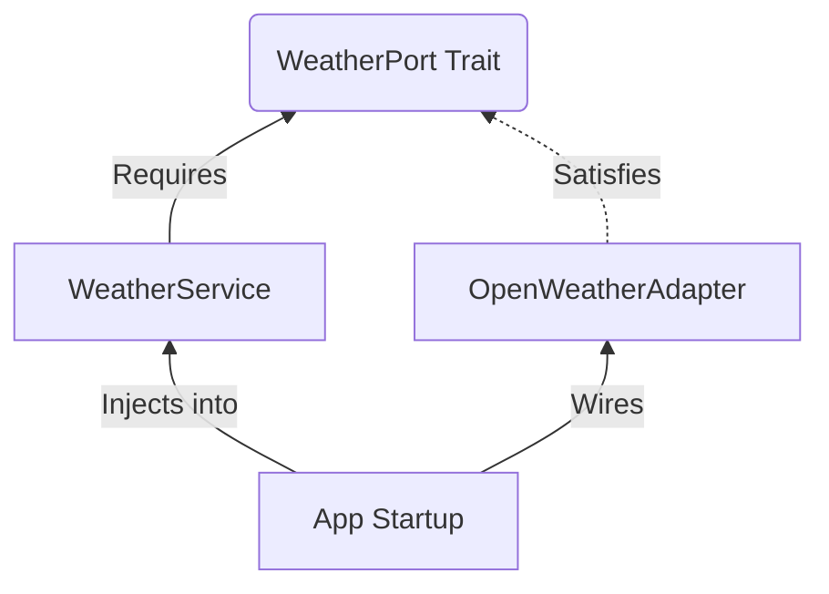

# Visual Architecture & Example Flow

This document provides a visual guide to the **Goose-in-a-Pond** architecture using the **Weather Feature** as a concrete implementation example.

---

## 🗺️ 1. Flowchart: Component Relationships

This flowchart illustrates how the logic is decoupled. Notice how the **Core** knows about the **Port**, but never about the **Adapter**.

---

## ⚡ 2. Sequence Diagram: Implementation Lifecycle

This diagram shows the "Time-Based" flow of data during a single weather request.

---

## 🧩 3. Dependency Injection (Wiring)

In Hexagonal Architecture, the "Wiring" happens in the main entry point (`pond-server`).

### The Blueprint
1. **The Service** asks for a `Box<dyn WeatherPort>`.
2. **The Server** builds the `OpenWeatherAdapter`.
3. **The Server** "plugs" the Adapter into the Service.

### Visualized Wiring

---

## 📝 Key Takeaways
- **Driven (Output)**: The Core defines the trait; the infra implements it.
- **Driving (Input)**: The server defines the endpoint; it calls the Core.
- **Direction of Dependencies**: All arrows point towards the **Core** or the **Port Traits** defined in the Core.
